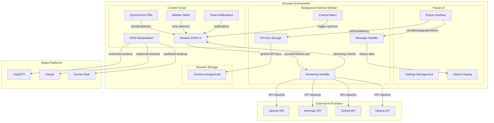
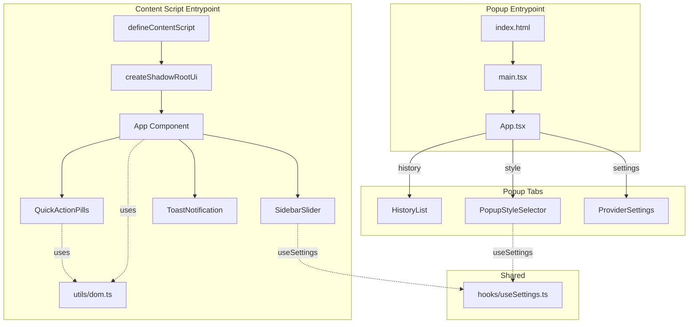
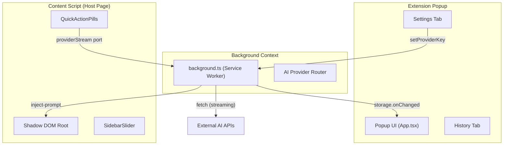
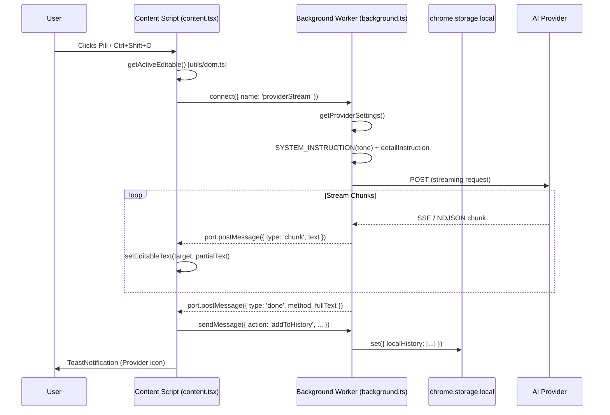
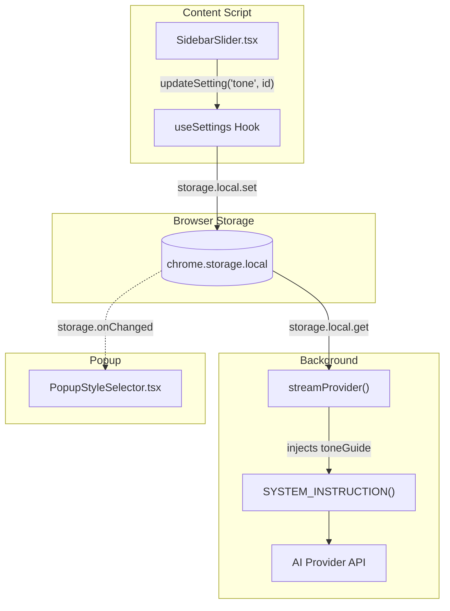
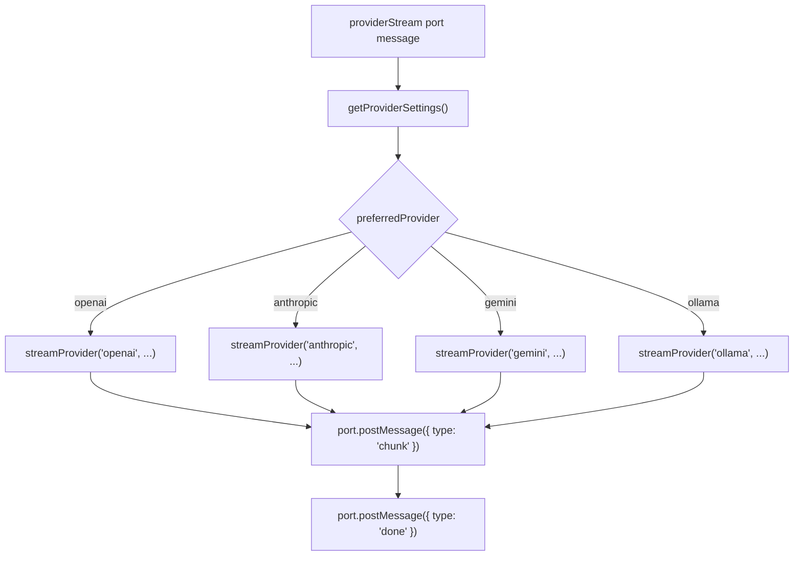
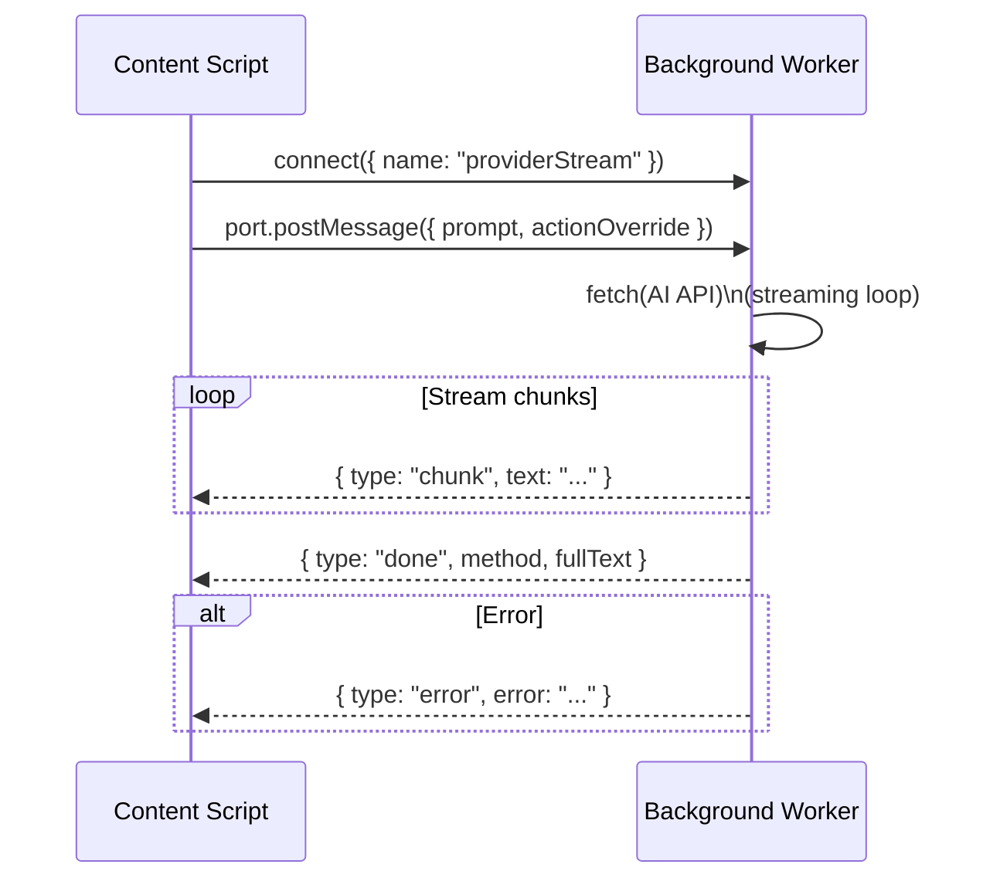

# Promptly 

> Enhance your AI prompts directly in the browser — no copy-pasting, no context switching.

Promptly is a **Manifest V3 Chrome Extension** built with the [WXT framework](https://wxt.dev/), React 19, and Tailwind CSS v4. It injects a seamless UI overlay into ChatGPT, Claude, and Gemini, allowing you to optimize prompts in one click using OpenAI, Anthropic, Google Gemini, or a local Ollama instance — all without your API keys ever leaving your machine.

<p align="center">
  
</p>

<table align="center">
  <tr>
    <td align="center">
      
    </td>
     <td align="center">
      
    </td>
    <td align="center">
      
    </td>
  </tr>
</table>


---

## Table of Contents

- [Features](#features)
- [Tech Stack](#tech-stack)
- [Project Structure](#project-structure)
- [Architecture Overview](#architecture-overview)
  - [Three-Layer Extension Model](#three-layer-extension-model)
  - [Component Hierarchy](#component-hierarchy)
  - [Subsystem Relationships](#subsystem-relationships)
- [Data Flow](#data-flow)
  - [Prompt Optimization Sequence](#prompt-optimization-sequence)
  - [Settings Propagation](#settings-propagation)
- [AI Provider Integration](#ai-provider-integration)
- [Prompt History](#prompt-history)
- [Message Passing API](#message-passing-api)
- [Getting Started](#getting-started)
  - [Prerequisites](#prerequisites)
  - [Installation](#installation)
  - [Environment Variables](#environment-variables)
  - [Build Commands](#build-commands)
  - [Loading in Browser](#loading-in-browser)
- [Configuration](#configuration)
- [Permissions](#permissions)

---

## Features

- **One-Click Prompt Enhancement** — Quick Action Pills float above the active textarea with actions: *Optimize*, *Fix Grammar*, *Make Professional*, *Summarize*
- **Keyboard Shortcut** — `Ctrl+Shift+O` triggers optimization from anywhere on the page
- **Right-Click Context Menu** — "✨ Optimize Prompt" available via browser context menu
- **Real-Time Streaming** — Optimized text streams token-by-token directly into the textarea, mimicking native AI UX
- **Multi-Provider Support** — OpenAI (GPT-4o mini), Anthropic (Claude Haiku), Google Gemini, and local Ollama
- **Prompt History** — 15-entry ring buffer with re-injection into the active tab
- **Tone & Detail Control** — Professional, Creative, Technical, Simple tones; Concise/Balanced/Comprehensive detail levels
- **Shadow DOM Isolation** — Extension UI never conflicts with host page styles
- **Privacy First** — API keys stored locally in `chrome.storage.local`, never sent to any intermediary server

---
## Tech Stack

| Layer | Technology |
|---|---|
| Framework | [WXT](https://wxt.dev/) v0.20+ (Web Extension Tooling) |
| UI | React 19 + TypeScript 5.9 |
| Styling | Tailwind CSS v4 (via `@tailwindcss/vite`) |
| Icons | `lucide-react` |
| Charts | `recharts` |
| Build | Vite (via WXT) |
| Target | Chrome Manifest V3 / Firefox MV2 |

---

## Project Structure

```
promptly/
├── entrypoints/
│   ├── background.ts        # Background Service Worker (AI calls, cache, message hub)
│   ├── content.tsx          # Content Script (Shadow DOM UI injection)
│   └── popup/
│       ├── App.tsx          # Popup root — tab navigation (History / Style / Settings)
│       ├── main.tsx         # React entry point
│       ├── index.html       # Popup HTML shell
│       └── style.css        # Tailwind global styles for popup
├── components/
│   ├── QuickActionPills.tsx # Floating action buttons above textarea
│   ├── SidebarSlider.tsx    # Hover-activated tone/detail panel
│   ├── ToastNotification.tsx# Success/error feedback toasts
│   ├── HistoryList.tsx      # Popup history tab with re-injection
│   ├── PopupStyleSelector.tsx # Tone & detail level selector
│   └── ProviderSettings.tsx # API key management UI
├── hooks/
│   └── useSettings.ts       # Reactive settings hook (tone, detail, custom instructions)
├── utils/
│   └── dom.ts               # Platform-specific DOM selectors & text manipulation
├── assets/
│   └── tailwind.css         # Tailwind CSS entry
├── wxt.config.ts            # WXT + Vite + manifest configuration
├── package.json
└── tsconfig.json
```

---

## Architecture Overview

### Three-Layer Extension Model

Promptly follows the standard Chrome MV3 three-context architecture, with each layer having strict responsibilities:

```
┌─────────────────────────────────────────────────────────────┐
│                     BROWSER TOOLBAR                         │
│                   ┌──────────────┐                          │
│                   │   Popup UI   │  (450×600px React App)   │
│                   │  App.tsx     │  History / Style /       │
│                   │              │  Settings tabs           │
│                   └──────┬───────┘                          │
│                          │ runtime.sendMessage              │
│                          ▼                                  │
│          ┌───────────────────────────────┐                  │
│          │  Background Service Worker    │                  │
│          │  background.ts                │                  │
│          │  • AI Provider routing        │                  │
│          │  • History ring buffer        │                  │
│          │  • API key management         │                  │
│          └──────────────┬────────────────┘                  │
│                         │ runtime.Port (providerStream)     │
│                         ▼                                   │
│          ┌───────────────────────────────┐                  │
│          │  Content Script               │                  │
│          │  content.tsx                  │                  │
│          │  • Shadow DOM UI              │                  │
│          │  • QuickActionPills           │                  │
│          │  • SidebarSlider              │                  │
│          │  • ToastNotification          │                  │
│          │  • DOM read/write (dom.ts)    │                  │
│          └───────────────────────────────┘                  │
│               Injected into: chatgpt.com                    │
│                             claude.ai                       │
│                             gemini.google.com               │
└─────────────────────────────────────────────────────────────┘
```



### Component Hierarchy



### Subsystem Relationships



---

## Data Flow

### Prompt Optimization Sequence




### Settings Propagation



The `useSettings` hook in `hooks/useSettings.ts` is the single source of truth for user preferences. It listens to `browser.storage.onChanged` so that changes made in the Sidebar Slider are immediately reflected in the Popup's Style tab, and vice versa.

---

## AI Provider Integration

All API calls are made **directly from the Background Service Worker** — API keys never leave the local machine.

| Provider | Model | Endpoint | Stream Format |
|---|---|---|---|
| **Gemini** | `gemini-3.5-flash` | `generativelanguage.googleapis.com/...streamGenerateContent` | Server-Sent Events |
| **OpenAI** | `gpt-4o-mini` | `api.openai.com/v1/chat/completions` | Server-Sent Events (`data:` prefix) |
| **Anthropic** | `claude-haiku-4-5` | `api.anthropic.com/v1/messages` | Server-Sent Events (`content_block_delta`) |
| **Ollama** | User-defined (e.g. `llama3`) | `localhost:11434/api/generate` | NDJSON (newline-delimited JSON) |

### Provider Routing Logic



### Quick Action Overrides

When a Quick Action Pill is clicked (not the main Optimize button), an `actionOverride` string is passed through the stream, replacing the default system prompt:

| Action | System Behavior |
|---|---|
| `Fix Grammar` | Professional editor — fix spelling/grammar/punctuation only |
| `Make Professional` | Corporate communicator — rewrite for formal tone |
| `Summarize` | Expert summarizer — output a concise summary |
| *(default)* | World-class Prompt Engineer — full prompt expansion |

### Tone Instructions

| Tone ID | Behavior |
|---|---|
| `professional` | Formal, structured, business-appropriate with clear headings |
| `creative` | Imaginative, expressive, encourages storytelling |
| `technical` | Precise, expert-level, includes constraints and edge cases |
| `simple` | Plain-English, jargon-free, easy to understand |

---

## Prompt History

### History Ring Buffer

The `localHistory` array in `chrome.storage.local` stores the last **15** enhancements:

| Field | Type | Description |
|---|---|---|
| `id` | `number` | Timestamp-based unique ID |
| `prompt` | `string` | Original user input |
| `compressed` | `string` | Final optimized output |
| `method` | `string` | Source: `cache`, `openai`, `anthropic`, `gemini-agent`, `ollama` |
| `timestamp` | `number` | Unix epoch of enhancement |

History entries are displayed in the Popup's **History Tab** with color-coded method badges:
- **Purple** — `gemini-agent`
- **Orange** — other providers

---

## Message Passing API

Communication between extension contexts uses `browser.runtime.sendMessage` (one-shot) and `browser.runtime.connect` (long-lived port for streaming).

### One-Shot Messages (`runtime.sendMessage`)

| Action | Direction | Description |
|---|---|---|
| `addToHistory` | Content → Background | Store a new optimization result in history |
| `getHistory` | Popup → Background | Retrieve `localHistory` array |
| `getProviderSettings` | Any → Background | Get provider config (keys masked) |
| `setProviderKey` | Popup → Background | Save an API key and set preferred provider |
| `removeProviderKey` | Popup → Background | Delete a stored API key |
| `trigger-optimize` | Background → Content | Trigger optimization (from context menu) |
| `inject-prompt` | Popup → Content | Insert a history entry into the active textarea |

### Long-Lived Port (`providerStream`)

Used for streaming AI responses chunk-by-chunk:



---

## Getting Started

### Prerequisites

- **Node.js** 18.x or higher
- **npm** (bundled with Node.js)

### Installation

```bash
git clone https://github.com/harshitzofficial/Promptly.git
cd Promptly
npm install
```

> `postinstall` automatically runs `wxt prepare` to generate TypeScript types.

### Environment Variables

Create a `.env` file in the project root:

```env
WXT_BACKEND_URL=http://localhost:3005
```

### Build Commands

| Command | Description |
|---|---|
| `npm run dev` | Start WXT dev server for Chrome (hot reload) |
| `npm run dev:firefox` | Start WXT dev server for Firefox |
| `npm run build` | Production build → `.output/chrome-mv3/` |
| `npm run build:firefox` | Production build for Firefox |
| `npm run zip` | Package extension as `.zip` for distribution |
| `npm run zip:firefox` | Package Firefox extension |
| `npm run compile` | TypeScript type-check (no emit) |

### Loading in Browser

Download chrome-mv3.zip from root of this repo.


**Chrome / Edge / Brave:**
1. Go to `chrome://extensions/`
2. Enable **Developer mode** (top-right toggle)
3. Click **Load unpacked**
4. Select `.output/chrome-mv3/`

**Firefox:**
1. Go to `about:debugging#/runtime/this-firefox`
2. Click **Load Temporary Add-on...**
3. Select `manifest.json` inside `.output/firefox-mv2/`


---

## Configuration

Open the extension popup from the browser toolbar and navigate to the **Settings** tab to configure your AI provider:

| Provider | What to enter |
|---|---|
| Google Gemini | Gemini API key from [Google AI Studio](https://aistudio.google.com/) |
| OpenAI | OpenAI API key (`sk-...`) |
| Anthropic | Anthropic API key |
| Ollama | Model name (e.g. `llama3`, `mistral`) — requires Ollama running locally on port `11434` |

Use the **Style** tab to set your preferred **Tone** and **Detail Level**. These settings sync instantly between the Popup and the in-page Sidebar Slider.

---

## Permissions

| Permission | Reason |
|---|---|
| `storage` | Persist API keys, history, and user preferences |
| `contextMenus` | Register the "✨ Optimize Prompt" right-click menu item |
| `*://chatgpt.com/*` | Inject content script into ChatGPT |
| `*://claude.ai/*` | Inject content script into Claude |
| `*://gemini.google.com/*` | Inject content script into Gemini |
| `https://api.openai.com/*` | Direct API calls from background worker |
| `https://api.anthropic.com/*` | Direct API calls from background worker |
| `https://generativelanguage.googleapis.com/*` | Direct API calls from background worker |
| `http://localhost:3005/*` | Local development backend |

[](https://deepwiki.com/harshitzofficial/Promptly)
