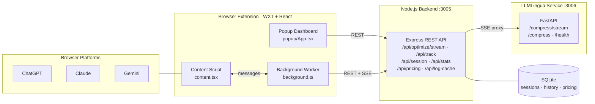
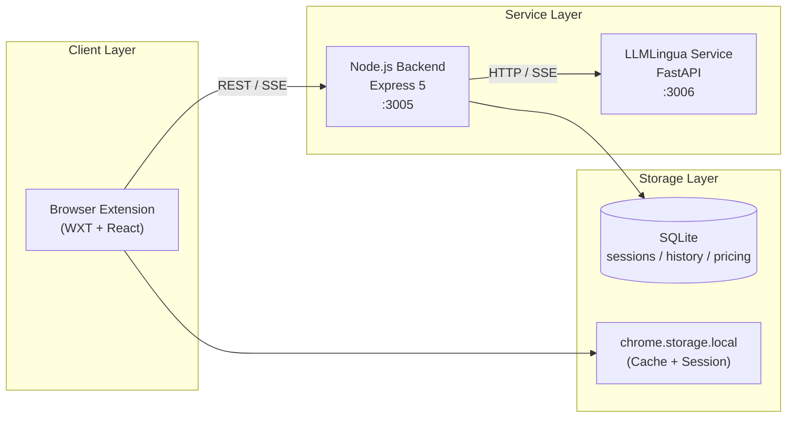
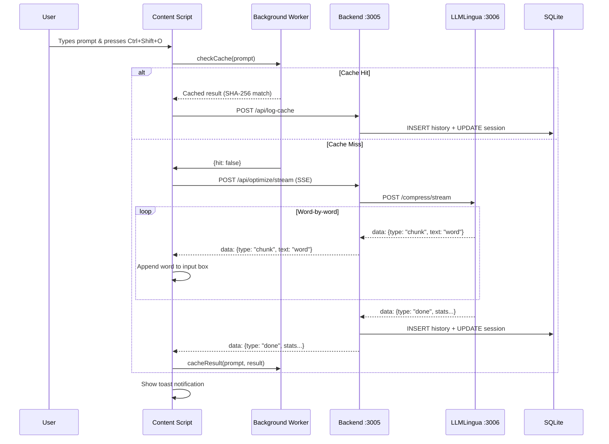
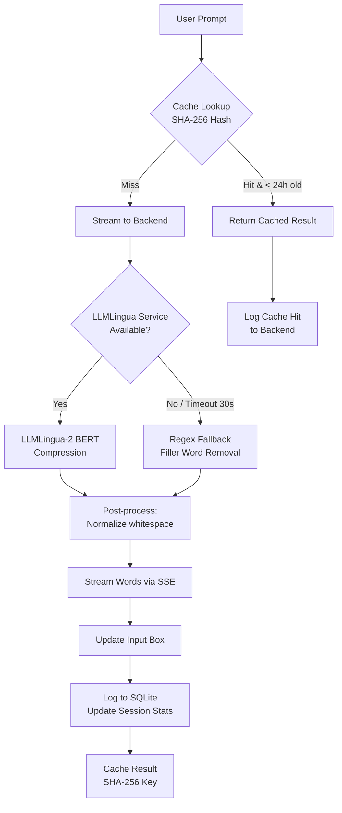
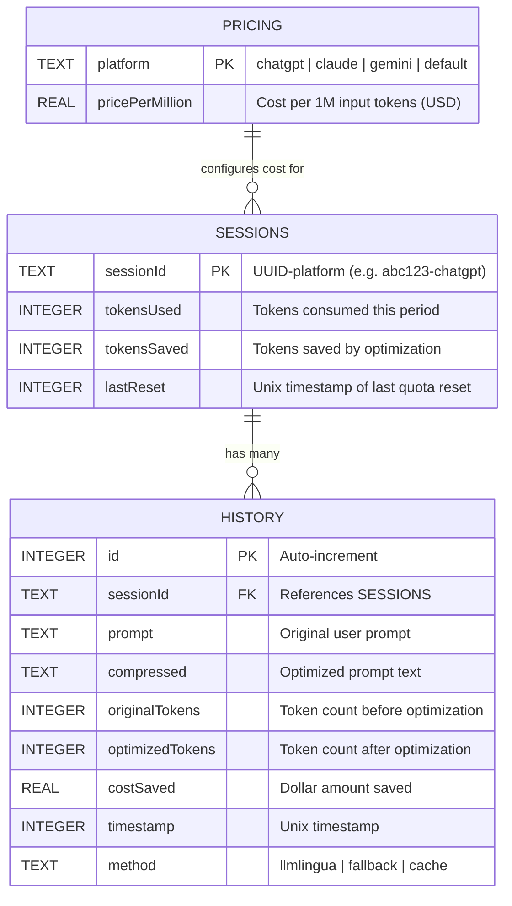
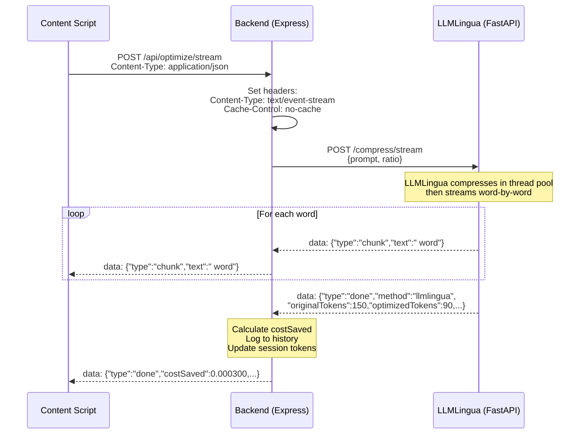
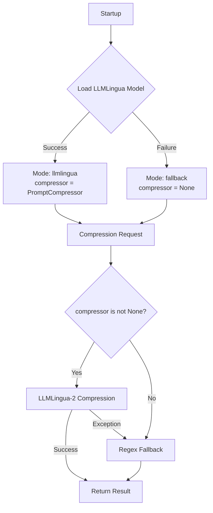

# Prompt Shaper

<<<<<<< HEAD
**Intelligent LLM Token Optimization & Cost Tracking System**

Prompt Shaper is a browser extension + backend system that automatically compresses your prompts before they reach ChatGPT, Claude, or Gemini — reducing token usage, lowering API costs, and tracking savings in real time.

---

## Table of Contents

- [Project Overview](#project-overview)
- [Getting Started](#getting-started)
  - [Prerequisites](#prerequisites)
  - [Docker Compose Setup](#docker-compose-setup)
  - [Browser Extension Setup](#browser-extension-setup)
  - [Backend (Native / Development)](#backend-native--development)
  - [Environment Variables](#environment-variables)
  - [Troubleshooting](#troubleshooting)
- [System Architecture & Data Flow](#system-architecture--data-flow)
  - [Service Topology](#service-topology)
  - [Component Interaction](#component-interaction)
  - [Optimization Pipeline](#optimization-pipeline)
  - [Entity Relationships](#entity-relationships)
  - [Streaming SSE Pipeline](#streaming-sse-pipeline)
  - [Session & Pricing Logic](#session--pricing-logic)
- [Browser Extension](#browser-extension)
  - [Content Script](#content-script)
  - [Background Service Worker](#background-service-worker)
  - [Popup Dashboard & Settings](#popup-dashboard--settings)
- [Node.js Backend](#nodejs-backend)
  - [REST API Endpoints](#rest-api-endpoints)
  - [Session Management & Token Accounting](#session-management--token-accounting)
  - [Database Layer](#database-layer)
  - [Build Tooling & TypeScript Configuration](#build-tooling--typescript-configuration)
- [LLMLingua Microservice](#llmlingua-microservice)
  - [FastAPI Service & Compression Endpoints](#fastapi-service--compression-endpoints)
  - [LLMLingua Model & Fallback Strategy](#llmlingua-model--fallback-strategy)
- [Infrastructure & Deployment](#infrastructure--deployment)
  - [Docker Compose Configuration](#docker-compose-configuration)
  - [Native Module Dependencies](#native-module-dependencies)
- [Glossary](#glossary)

---

## Project Overview

Prompt Shaper is a three-component system designed to reduce LLM token consumption across major AI chat platforms:

| Component | Technology | Port | Purpose |
|-----------|-----------|------|---------|
| **Browser Extension** | React 19, WXT, TypeScript, Tailwind CSS 4 | — | Intercepts prompts on ChatGPT/Claude/Gemini, streams optimized text back into the input box, and displays real-time savings |
| **Node.js Backend** | Express 5, better-sqlite3, js-tiktoken | `3005` | REST API for token counting, session management, pricing configuration, optimization history, and SSE stream proxying |
| **LLMLingua Microservice** | FastAPI, LLMLingua 2, tiktoken | `3006` | AI-powered prompt compression using Microsoft's LLMLingua-2 BERT model with regex fallback |

### Capabilities

- **AI-Powered Compression** — Uses Microsoft LLMLingua-2 (`bert-base-multilingual-cased-meetingbank`) to intelligently compress prompts while preserving semantic meaning
- **Streaming Optimization** — Real-time Server-Sent Events (SSE) pipeline streams compressed words into the chat input as they are generated
- **Multi-Platform Support** — Works on ChatGPT (`chatgpt.com`), Claude (`claude.ai`), and Gemini (`gemini.google.com`)
- **Token & Cost Tracking** — Per-session tracking of tokens used/saved with configurable per-platform pricing ($/1M tokens)
- **Prompt Caching** — SHA-256 based client-side cache with 24-hour TTL to avoid re-compressing identical prompts
- **Automatic Fallback** — Regex-based filler-word removal when the LLMLingua model is unavailable or times out
- **Submission Detection** — Heuristic detection of prompt submissions (Enter key / button clicks) for automatic usage tracking
- **Adjustable Compression** — Three compression levels: Light (0.8 ratio), Balanced (0.6), and Max (0.3)

### High-Level Architecture



---

## Getting Started

### Prerequisites

| Tool | Version | Required For |
|------|---------|-------------|
| **Docker** & **Docker Compose** | v20+ / v2+ | Running the full stack |
| **Node.js** | v20+ | Backend development (native mode) |
| **Python** | 3.10+ | LLMLingua service (native mode) |
| **npm** | v9+ | Dependency management |

### Docker Compose Setup

The fastest way to run the entire system:

```bash
# Clone the repository
git clone https://github.com/harshitzofficial/Prompt-shaper.git
cd Prompt-shaper

# Build and start all services
docker compose up --build
```

This starts:
- **LLMLingua Microservice** on `http://localhost:3006` (builds first, downloads ~400MB model on first build)
- **Node.js Backend** on `http://localhost:3005` (waits for LLMLingua to be ready)

Data is persisted in a Docker volume named `prompt_shaper_data`.

### Browser Extension Setup

The extension uses [WXT](https://wxt.dev/) (Web Extension Tooling) with React:

```bash
cd extension

# Install dependencies
npm install

# Start development mode (hot-reload)
npm run dev

# Build for production
npm run build
```

**Loading in Chrome (development):**
1. Navigate to `chrome://extensions`
2. Enable **Developer mode** (top right)
3. Click **Load unpacked**
4. Select the `extension/.output/chrome-mv3` directory

**Supported platforms:**
- Chrome (Manifest V3) — `npm run build`
- Firefox — `npm run build:firefox`

### Backend (Native / Development)

To run the backend outside Docker:

```bash
cd backend
npm install
npm run dev    # Uses tsx for hot-reloading TypeScript
```

For the LLMLingua service:

```bash
cd llmlingua-service
pip install -r requirements.txt
python main.py
```

> **Note:** On Windows, you can use the provided `start.bat` script in `llmlingua-service/` which handles dependency installation and startup.

### Environment Variables

| Variable | Default | Service | Description |
|----------|---------|---------|-------------|
| `PORT` | `3005` | Backend | HTTP listen port |
| `LLMLINGUA_URL` | `http://localhost:3006/compress/stream` | Backend | URL of the LLMLingua streaming endpoint |
| `DB_PATH` | `./database.sqlite` (relative to `src/`) | Backend | SQLite database file path |

Inside Docker Compose, these are configured automatically:
- `LLMLINGUA_URL` → `http://llmlingua:3006/compress/stream` (Docker service DNS)
- `DB_PATH` → `/usr/src/app/data/database.sqlite` (persistent volume)

### Troubleshooting

| Issue | Solution |
|-------|----------|
| **Backend can't connect to LLMLingua** | Ensure the LLMLingua service is running on port 3006. Check `docker compose logs llmlingua` for startup errors. The backend falls back to regex compression automatically. |
| **Extension shows "Failed to connect to backend"** | Verify the backend is running on `http://localhost:3005`. Check the popup for the error screen. |
| **First Docker build is slow** | The LLMLingua Dockerfile pre-downloads the ~400MB BERT model during build. Subsequent builds use the Docker cache. |
| **`better-sqlite3` build fails** | The Alpine Dockerfile installs `python3 make g++` for native compilation. For local development, ensure you have C++ build tools installed. |
| **Model download hangs** | The LLMLingua model is fetched from HuggingFace. Ensure network access to `huggingface.co`. |
| **Extension not detecting input box** | Prompt Shaper uses platform-specific selectors (`#prompt-textarea` for ChatGPT, `.ProseMirror` for Claude, `rich-textarea` for Gemini). Platform UI updates may require selector adjustments. |

---

## System Architecture & Data Flow

### Service Topology



### Component Interaction



### Optimization Pipeline



### Entity Relationships



### Streaming SSE Pipeline

The streaming optimization uses Server-Sent Events (SSE) across two hops:



**SSE Event Types:**

| Type | Payload | Description |
|------|---------|-------------|
| `chunk` | `{ type: "chunk", text: " word" }` | A single word/token of compressed output |
| `done` | `{ type: "done", method, originalTokens, optimizedTokens, tokensSaved, percentSaved, optimizedPrompt, costSaved }` | Final statistics after compression completes |
| `error` | `{ type: "error", message: "..." }` | Error from the LLMLingua service |

### Session & Pricing Logic

Sessions are identified by a compound key: `{UUID}-{platform}` where platform is detected from the current tab URL.

**Platform Configuration:**

| Platform | Session Suffix | Token Limit | Refresh Interval | Default Price ($/1M tokens) |
|----------|---------------|-------------|-------------------|-----------------------------|
| ChatGPT | `-chatgpt` | 40,000 | 3 hours | $5.00 |
| Claude | `-claude` | 200,000 | 5 hours | $3.00 |
| Gemini | `-gemini` | 1,000,000 | 24 hours | $1.25 |
| Default | (other) | 10,000 | 24 hours | $1.00 |

**Cost Calculation:**
```
costSaved = (tokensSaved / 1,000,000) × pricePerMillion
```

**Session Lifecycle:**
1. On first request, a session row is created in SQLite with `tokensUsed = 0`, `tokensSaved = 0`
2. On each optimization, `tokensSaved` is incremented
3. On each prompt submission (detected heuristically), `tokensUsed` is incremented via `/api/track`
4. When `Date.now() - lastReset > refreshMs`, the session's `tokensUsed` resets to 0

---

## Browser Extension

Built with [WXT](https://wxt.dev/) (Web Extension Tooling) and React 19. Uses Tailwind CSS 4 for styling and Manifest V3 for Chrome compatibility.

**Permissions:**
- `storage` — Local cache and session persistence
- `contextMenus` — Right-click "Optimize Prompt" option

**Host Permissions:**
- `*://chatgpt.com/*`
- `*://claude.ai/*`
- `*://gemini.google.com/*`
- `http://localhost:3005/*`

### Content Script

> **Source:** `extension/entrypoints/content.tsx`

The content script injects a React overlay into supported LLM chat pages. It runs in a Shadow DOM (`cssInjectionMode: 'ui'`) to avoid CSS conflicts with the host page.

**Platform-Specific Input Detection:**

| Platform | Selector | Element Type |
|----------|----------|-------------|
| ChatGPT | `#prompt-textarea` | `<textarea>` |
| Claude | `.ProseMirror` | `<div contenteditable>` |
| Gemini | `rich-textarea > div[contenteditable="true"]`, `.ql-editor`, `div[role="textbox"][contenteditable="true"]` | `<div contenteditable>` |
| Fallback | `document.activeElement` | Any focused `<textarea>`, `<input>`, or `contenteditable` |

**Key Features:**

- **Floating Tracker Panel** — A slide-out panel anchored to the right edge of the viewport showing:
  - Total tokens saved and estimated cost savings
  - Token quota progress bar (used / limit)
  - Compression level selector (Light 0.8 / Balanced 0.6 / Max 0.3)
  - Cache statistics (entries and hits)
  - Quota refresh countdown
- **Toast Notifications** — Appears at top-right after each optimization showing tokens saved, percentage, method used (LLMLingua / fallback / cache), and cost saved
- **Submission Detection** — Polls every 500ms for text changes. When text clears within 2 seconds of an Enter key press or button click, it infers a prompt was submitted and calls `/api/track`
- **Keyboard Shortcut** — `Ctrl+Shift+O` triggers optimization
- **Context Menu** — Right-click → "Optimize Prompt" (registered by background worker)
- **Streaming Input** — During SSE streaming, words are appended to the input box in real time using platform-aware `setEditableText()` that dispatches proper `input`/`change` events for React/Vue reactivity

### Background Service Worker

> **Source:** `extension/entrypoints/background.ts`

The background script handles all network communication, caching, and session management.

**Message Actions:**

| Action | Direction | Description |
|--------|-----------|-------------|
| `optimize` | Content → Background | Compress a prompt (checks cache first, then calls `POST /api/optimize`) |
| `trackUsage` | Content → Background | Log submitted prompt tokens via `POST /api/track` |
| `getSession` | Content → Background | Fetch session stats from `GET /api/session/:id` with local fallback |
| `checkCache` | Content → Background | Check SHA-256 cache for a prompt without calling backend |
| `cacheResult` | Content → Background | Store optimization result in `chrome.storage.local` |
| `getCacheStats` | Content → Background | Return cache entry count and total hit count |
| `clearCache` | Content → Background | Remove all `cache:*` keys and reset hit counter |

**Prompt Cache System:**
- **Key Format:** `cache:<SHA-256 hash of prompt>`
- **TTL:** 24 hours (entries older than 24h are evicted on read)
- **Storage:** `chrome.storage.local` (persists across browser restarts)
- **Hash Function:** `crypto.subtle.digest('SHA-256', ...)` for collision-resistant keying
- **Hit Tracking:** Global `cacheHits` counter incremented on each cache hit

**Session Persistence:**
- Session data from the backend is mirrored to `chrome.storage.local` as `session:<sessionId>`
- When the backend is unreachable, the background worker serves the last persisted session data
- Platform detection from `sender.tab.url` → `chatgpt` | `claude` | `gemini` | `default`
- Session ID format: `{UUID}-{platform}` where UUID is generated once via `crypto.randomUUID()` and stored in `chrome.storage.local`

### Popup Dashboard & Settings

> **Source:** `extension/entrypoints/popup/App.tsx`

The popup opens from the extension toolbar icon and provides two tabs:

**Dashboard Tab:**
- **Total Estimated Savings** — Aggregated dollar amount saved across all sessions
- **Tokens Saved Chart** — 7-day line chart (Recharts `LineChart`) showing daily token savings
- **Optimization History** — Searchable table of past optimizations with:
  - Method badge (`llmlingua` purple / `fallback` orange)
  - Timestamp
  - Cost saved per entry
  - Original → optimized token counts
  - Percentage saved
  - Truncated prompt preview

**Settings Tab:**
- **API Pricing Configuration** — Editable price-per-million-tokens for each platform:
  - ChatGPT: $5.00 (default)
  - Claude: $3.00 (default)
  - Gemini: $1.25 (default)
  - Fallback Model: $1.00 (default)
- Changes persist to the backend SQLite database via `POST /api/pricing`

**Tech Stack:**
- React 19 with hooks (`useState`, `useEffect`)
- [Recharts](https://recharts.org/) for the savings chart
- [Lucide React](https://lucide.dev/) for icons (`Zap`, `DollarSign`, `History`, `Search`, `AlertCircle`, `Settings`)
- Tailwind CSS 4 with dark theme (`bg-[#0a0a0a]`)
- Fixed dimensions: 450×600px

---

## Node.js Backend

> **Source:** `backend/src/main.ts`, `backend/src/db.ts`

Express 5 REST API serving as the central coordination layer between the browser extension and the LLMLingua microservice.

### REST API Endpoints

#### `GET /api/pricing`
Returns all platform pricing configurations.

**Response:**
```json
{
  "success": true,
  "pricing": [
    { "platform": "chatgpt", "pricePerMillion": 5.00 },
    { "platform": "claude", "pricePerMillion": 3.00 },
    { "platform": "gemini", "pricePerMillion": 1.25 },
    { "platform": "default", "pricePerMillion": 1.00 }
  ]
}
```

#### `POST /api/pricing`
Update pricing for a specific platform.

**Request Body:**
```json
{ "platform": "chatgpt", "pricePerMillion": 5.50 }
```

#### `POST /api/track`
Record token usage for a submitted prompt (called automatically when submission is detected).

**Request Body:**
```json
{ "prompt": "the full prompt text", "sessionId": "uuid-chatgpt" }
```

**Response:**
```json
{ "success": true, "tokensUsedAdded": 42 }
```

#### `GET /api/session/:sessionId`
Retrieve session statistics including quota and savings.

**Response:**
```json
{
  "tokensUsed": 1500,
  "tokensSaved": 3200,
  "limit": 40000,
  "remaining": 38500,
  "timeUntilRefreshMs": 7200000,
  "totalCostSaved": 0.016000
}
```

#### `GET /api/stats`
Aggregated analytics for the popup dashboard.

**Response:**
```json
{
  "success": true,
  "totalMoneySaved": 0.0542,
  "chartData": [
    { "date": "5/17", "tokens": 320 },
    { "date": "5/18", "tokens": 150 }
  ],
  "history": [
    {
      "id": 1,
      "sessionId": "abc-chatgpt",
      "prompt": "original text...",
      "compressed": "optimized text...",
      "originalTokens": 150,
      "optimizedTokens": 90,
      "costSaved": 0.000300,
      "timestamp": 1716000000000,
      "method": "llmlingua"
    }
  ]
}
```

#### `POST /api/optimize/stream`
Main optimization endpoint. Streams compressed prompt via SSE.

**Request Body:**
```json
{ "prompt": "the prompt to optimize", "sessionId": "uuid-chatgpt", "ratio": 0.6 }
```

**Response:** `text/event-stream` — See [Streaming SSE Pipeline](#streaming-sse-pipeline) for event format.

**Behavior:**
1. Sets SSE headers (`Content-Type: text/event-stream`, `Cache-Control: no-cache`)
2. Proxies the request to `LLMLINGUA_URL` with a 30-second timeout
3. Reads the upstream SSE stream and forwards events to the client
4. On the `done` event: calculates `costSaved`, logs to `history` table, updates session
5. On upstream failure: falls back to `regexCompress()`, streams word-by-word with 20ms delay

#### `POST /api/log-cache`
Record a cache-hit optimization in history and session stats.

**Request Body:**
```json
{
  "sessionId": "uuid-chatgpt",
  "prompt": "original text",
  "compressed": "cached compressed text",
  "originalTokens": 150,
  "optimizedTokens": 90
}
```

### Session Management & Token Accounting

Sessions are keyed by `{UUID}-{platform}` and stored in SQLite. The backend manages:

- **Token Counting** — Uses `js-tiktoken` with the `cl100k_base` encoding (matches OpenAI's tokenizer) for exact token counts
- **Quota Tracking** — Each session has a `tokensUsed` counter that resets after the platform-specific refresh interval
- **Savings Accumulation** — `tokensSaved` accumulates across resets (never resets)
- **Cost Calculation** — `(tokensSaved / 1,000,000) × pricePerMillion` computed at query time using the pricing table

**Regex Fallback Compression:**

When LLMLingua is unavailable, the backend applies regex-based compression (`regexCompress()`):
- Removes filler phrases: `please`, `can you`, `could you`, `would you mind`, `I was wondering if`, `I would like you to`, `make sure to`, `it would be great if`, `kindly`
- Collapses 3+ consecutive newlines → double newline
- Collapses 2+ consecutive spaces/tabs → single space

### Database Layer

> **Source:** `backend/src/db.ts`

Uses [`better-sqlite3`](https://github.com/WiseLibs/better-sqlite3) for synchronous, high-performance SQLite access.

**Schema:**

```sql
CREATE TABLE IF NOT EXISTS sessions (
    sessionId TEXT PRIMARY KEY,
    tokensUsed INTEGER DEFAULT 0,
    tokensSaved INTEGER DEFAULT 0,
    lastReset INTEGER
);

CREATE TABLE IF NOT EXISTS history (
    id INTEGER PRIMARY KEY AUTOINCREMENT,
    sessionId TEXT,
    prompt TEXT,
    compressed TEXT,
    originalTokens INTEGER,
    optimizedTokens INTEGER,
    costSaved REAL,
    timestamp INTEGER,
    method TEXT
);

CREATE TABLE IF NOT EXISTS pricing (
    platform TEXT PRIMARY KEY,
    pricePerMillion REAL
);
```

**Seed Data:** The pricing table is seeded with `INSERT OR IGNORE` on startup:
- `chatgpt` → $5.00
- `claude` → $3.00
- `gemini` → $1.25
- `default` → $1.00

**Database Path Resolution:**
- Environment variable: `DB_PATH`
- Default: `../database.sqlite` relative to the compiled `dist/` output
- Docker: `/usr/src/app/data/database.sqlite` (persisted volume)

### Build Tooling & TypeScript Configuration

**Backend (`backend/tsconfig.json`):**

| Option | Value | Purpose |
|--------|-------|---------|
| `module` | `nodenext` | Node.js ESM module resolution |
| `target` | `esnext` | Latest JavaScript features |
| `rootDir` | `./src` | Source directory |
| `outDir` | `./dist` | Compiled output |
| `strict` | `true` | Full strict mode |
| `verbatimModuleSyntax` | `true` | Enforces explicit `type` imports |
| `isolatedModules` | `true` | Ensures compatibility with single-file transpilers |
| `noUncheckedIndexedAccess` | `true` | Adds `undefined` to index signatures |
| `exactOptionalPropertyTypes` | `true` | Distinguishes `undefined` from missing properties |
| `sourceMap` | `true` | Generates `.js.map` files |
| `jsx` | `react-jsx` | JSX transform |

**Build Scripts:**

| Script | Command | Purpose |
|--------|---------|---------|
| `npm run dev` | `tsx watch src/main.ts` | Development with hot-reload |
| `npm run build` | `tsc` | TypeScript compilation to `dist/` |

**Extension (`extension/tsconfig.json`):**
- Extends `.wxt/tsconfig.json` (auto-generated by WXT)
- Enables `allowImportingTsExtensions` and `react-jsx`

**Extension Build Scripts:**

| Script | Command | Purpose |
|--------|---------|---------|
| `npm run dev` | `wxt` | WXT dev server with hot-reload |
| `npm run build` | `wxt build` | Production build for Chrome |
| `npm run build:firefox` | `wxt build -b firefox` | Production build for Firefox |
| `npm run zip` | `wxt zip` | Package as `.zip` for distribution |
| `npm run compile` | `tsc --noEmit` | Type-check without emitting |

---

## LLMLingua Microservice

> **Source:** `llmlingua-service/main.py`

A standalone FastAPI microservice that provides AI-powered prompt compression using Microsoft's [LLMLingua-2](https://github.com/microsoft/LLMLingua) library.

### FastAPI Service & Compression Endpoints

**Application Configuration:**
- Title: "Prompt Shaper — LLMLingua Worker"
- CORS: All origins allowed (`*`)
- Port: 3006 (via Uvicorn)
- Tokenizer: `tiktoken` with `cl100k_base` encoding (matches the Node.js backend exactly)

#### `GET /health`
Health check endpoint.

**Response:**
```json
{
  "status": "ok",
  "model_loaded": true,
  "mode": "llmlingua"
}
```

#### `POST /compress`
Synchronous compression endpoint.

**Request Body (`CompressRequest`):**
```json
{
  "prompt": "text to compress",
  "ratio": 0.6,
  "target_token": -1
}
```

| Field | Type | Default | Description |
|-------|------|---------|-------------|
| `prompt` | `string` | (required) | Text to compress |
| `ratio` | `float` | `0.6` | Token retention ratio (0.6 = keep 60% of tokens) |
| `target_token` | `int` | `-1` | Hard token limit (-1 = use ratio instead) |

**Response (`CompressResponse`):**
```json
{
  "compressed_prompt": "optimized text",
  "origin_tokens": 150,
  "compressed_tokens": 90,
  "tokens_saved": 60,
  "percent_saved": 40.0,
  "method": "llmlingua"
}
```

#### `POST /compress/stream`
Streaming compression endpoint — the primary endpoint used by the backend.

**Request Body:** Same as `POST /compress`.

**Response:** `text/event-stream` with the following events:

1. **Chunk events** (one per word):
   ```
   data: {"type": "chunk", "text": " word"}
   ```
2. **Done event** (final):
   ```
   data: {"type": "done", "method": "llmlingua", "originalTokens": 150, "optimizedTokens": 90, "tokensSaved": 60, "percentSaved": 40.0, "optimizedPrompt": "full compressed text"}
   ```
3. **Error event** (on failure):
   ```
   data: {"type": "error", "message": "error description"}
   ```

**Implementation:**
- LLMLingua compression runs in a thread pool executor (`loop.run_in_executor`) to keep the async event loop responsive
- Words are streamed with a 25ms inter-word delay for smooth client-side rendering
- Post-processing normalizes LLMLingua output: single `\n` → space, multiple `\n` → `\n\n`, collapse extra spaces

### LLMLingua Model & Fallback Strategy

**Primary Model:**
- **Library:** [LLMLingua](https://pypi.org/project/llmlingua/) (`PromptCompressor`)
- **Model:** `microsoft/llmlingua-2-bert-base-multilingual-cased-meetingbank`
- **Algorithm:** LLMLingua-2 (uses `compress_prompt_llmlingua2()`)
- **Device:** CPU (`device_map="cpu"`)
- **First Run:** Downloads ~400MB from HuggingFace (cached for subsequent runs)

> **Note:** The Dockerfile pre-downloads a different model variant (`llmlingua-2-xlm-roberta-large-meetingbank`) during build to cache it in the image layer, while `main.py` loads `bert-base-multilingual-cased-meetingbank` at runtime.

**Fallback Strategy:**

If the LLMLingua model fails to load (missing dependencies, insufficient memory, download failure), the service automatically falls back to regex-based compression:



**Regex Fallback** removes these filler phrases (case-insensitive):
- `please`, `can you`, `could you`, `would you mind`
- `I was wondering if`, `I would like you to`, `make sure to`
- `it would be great if`, `kindly`, `if you don't mind`, `if possible`

Then normalizes whitespace (collapse multiple newlines and spaces).

---

## Infrastructure & Deployment

### Docker Compose Configuration

> **Source:** `docker-compose.yml`

```yaml
version: '3.8'

services:
  llmlingua:
    build:
      context: ./llmlingua-service
      dockerfile: Dockerfile
    ports:
      - "3006:3006"
    restart: unless-stopped
    healthcheck:
      test: ["CMD", "python", "-c", "import urllib.request; urllib.request.urlopen('http://localhost:3006/docs')"]
      interval: 30s
      timeout: 10s
      retries: 3

  backend:
    build:
      context: ./backend
      dockerfile: Dockerfile
    ports:
      - "3005:3005"
    depends_on:
      - llmlingua
    environment:
      - PORT=3005
      - LLMLINGUA_URL=http://llmlingua:3006/compress/stream
      - DB_PATH=/usr/src/app/data/database.sqlite
    volumes:
      - prompt_shaper_data:/usr/src/app/data
    restart: unless-stopped

volumes:
  prompt_shaper_data:
```

**Key Design Decisions:**
- `depends_on: llmlingua` ensures the backend starts after LLMLingua (but does not wait for health; the backend gracefully falls back to regex)
- `restart: unless-stopped` keeps both services running across Docker daemon restarts
- Named volume `prompt_shaper_data` persists the SQLite database across container rebuilds
- LLMLingua healthcheck hits the FastAPI `/docs` endpoint every 30 seconds

**LLMLingua Dockerfile (`llmlingua-service/Dockerfile`):**
- Base: `python:3.10-slim`
- Installs `build-essential` for native C extensions
- Installs Python dependencies from `requirements.txt` (`llmlingua`, `fastapi`, `uvicorn[standard]`)
- Pre-downloads the LLMLingua model during build (`RUN python -c "from llmlingua import PromptCompressor; ..."`)
- Entrypoint: `uvicorn main:app --host 0.0.0.0 --port 3006`

**Backend Dockerfile (`backend/Dockerfile`):**
- Base: `node:20-alpine`
- Installs `python3 make g++` for `better-sqlite3` native compilation
- Runs `npm ci` for deterministic installs, then `npm run build` (TypeScript → JavaScript)
- Entrypoint: `node dist/main.js`

### Native Module Dependencies

**`better-sqlite3`** requires native C++ compilation:

| Environment | Build Tools |
|-------------|-------------|
| Docker (Alpine) | `python3 make g++` (installed via `apk`) |
| macOS | Xcode Command Line Tools (`xcode-select --install`) |
| Linux (Debian/Ubuntu) | `build-essential python3` |
| Windows | [windows-build-tools](https://www.npmjs.com/package/windows-build-tools) or Visual Studio C++ workload |

The `.dockerignore` files ensure clean builds:
- **Backend:** Excludes `node_modules`, `dist`, `.env`, `database.sqlite`, `data`
- **LLMLingua:** Excludes `__pycache__`, `.pyc`, `.env`, `.venv`, `venv`

---

## Glossary

### Core Domain Concepts

| Term | Definition |
|------|-----------|
| **Prompt Compression** | Reducing the token count of a user prompt while preserving its semantic meaning, enabling the same instruction to be communicated to an LLM using fewer tokens |
| **Token** | The fundamental unit of text processed by LLMs. Prompt Shaper uses the `cl100k_base` encoding (via `js-tiktoken` and `tiktoken`) which is the tokenizer for GPT-4 and GPT-3.5 |
| **Token Optimization** | The overall process of minimizing LLM input tokens to reduce costs, encompassing both AI-based compression and regex-based filler removal |
| **Cost Saved** | The financial delta between the original token count and the optimized token count, calculated as `(tokensSaved / 1,000,000) × pricePerMillion` |
| **Price Per Million** | The standardized unit for LLM API pricing — the cost in USD to process one million input tokens on a given platform |
| **Compression Ratio** | The fraction of tokens to retain after compression. A ratio of `0.6` means "keep 60% of tokens." Three presets: Light (0.8), Balanced (0.6), Max (0.3) |
| **Filler Phrase** | Polite or redundant language (e.g., "please", "could you", "I was wondering if") that can be safely removed without changing the prompt's meaning |

### Architectural Components

| Term | Definition |
|------|-----------|
| **Content Script** | The WXT/React script injected into LLM chat pages that provides the floating tracker UI, handles input detection, triggers optimization, and streams compressed text back into the input box |
| **Background Service Worker** | The extension's persistent script (Manifest V3) that manages network requests, prompt caching (SHA-256), session persistence, and message routing between the content script and backend |
| **Popup Dashboard** | The extension toolbar popup (450×600px) showing aggregated savings, a 7-day chart, searchable optimization history, and per-platform pricing settings |
| **SSE (Server-Sent Events)** | The streaming protocol used to deliver compressed prompt words in real time from the LLMLingua service → Backend → Content Script |
| **Shadow DOM** | Used by the content script (`cssInjectionMode: 'ui'`) to isolate the overlay UI styles from the host page's CSS |

### Technical Terms

| Term | Definition |
|------|-----------|
| **LLMLingua-2** | Microsoft's token compression algorithm that uses a trained BERT model to identify and remove low-information tokens while preserving meaning. Used via `compress_prompt_llmlingua2()` |
| **better-sqlite3** | A high-performance synchronous SQLite3 driver for Node.js with native C++ bindings. Requires compilation toolchain on installation |
| **WXT** | Web Extension Tooling — a framework for building cross-browser extensions with hot-reload, TypeScript support, and unified APIs. Replaces raw Manifest V3 boilerplate |
| **js-tiktoken** | JavaScript port of OpenAI's tiktoken tokenizer. Used with the `cl100k_base` encoding for exact token counting that matches OpenAI's API |
| **Session ID** | A compound identifier in the format `{UUID}-{platform}` (e.g., `a1b2c3d4-chatgpt`). The UUID is generated once per extension install via `crypto.randomUUID()` |
| **Prebuild-install** | A utility used by `better-sqlite3` to fetch pre-compiled native binaries, avoiding the need for a local C++ toolchain when a matching prebuild exists |
| **NodeNext** | TypeScript's module resolution strategy for Node.js ESM. Requires explicit `.js` extensions in imports and enforces `"type": "module"` in `package.json` |
| **Build Isolation** | The Docker strategy of excluding host artifacts (`node_modules`, `dist`, `database.sqlite`) via `.dockerignore` to ensure clean, reproducible container builds |

---

## License

This project is [ISC](https://opensource.org/licenses/ISC) licensed.
=======
A full-stack monorepo application containing a Chrome Extension and a Node.js API that optimizes AI prompts to reduce token costs.

## Project Structure

This project uses NPM Workspaces to manage multiple applications in one repository.

- `/apps/extension` - The React/WXT browser extension.
- `/apps/backend` - The Node.js Express server that interfaces with Gemini.

## Getting Started

1. Install all dependencies from the root:
   ```bash
   npm install
   ```

2. Run both the backend and extension in development mode simultaneously:
   ```bash
   npm run dev
   ```

*Make sure you have added your `GEMINI_API_KEY` to `/apps/backend/.env`!*
>>>>>>> e216f71 (feat: Massive optimization refactor including True Streaming, Semantic Caching, Database Indexing, Fallback expansion, and Custom Provider Pricing API)
