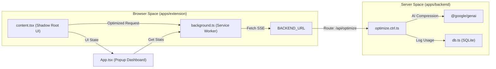
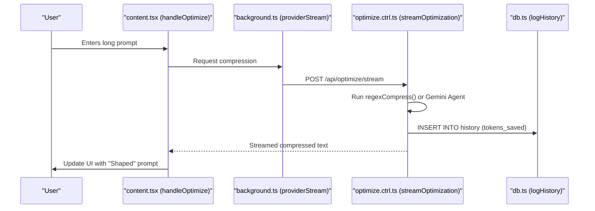
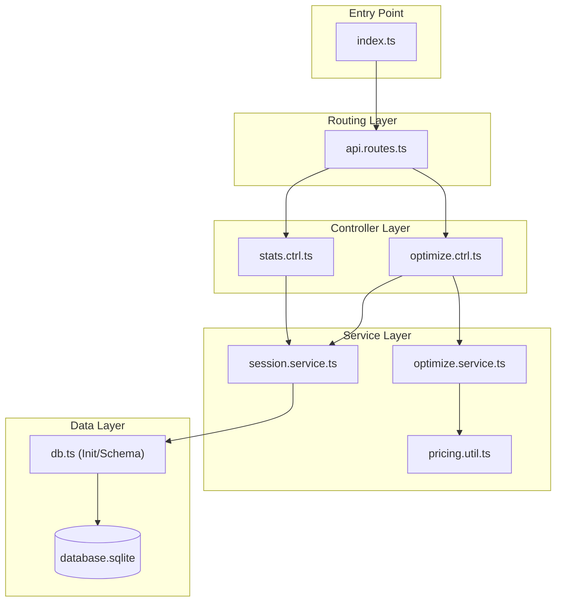
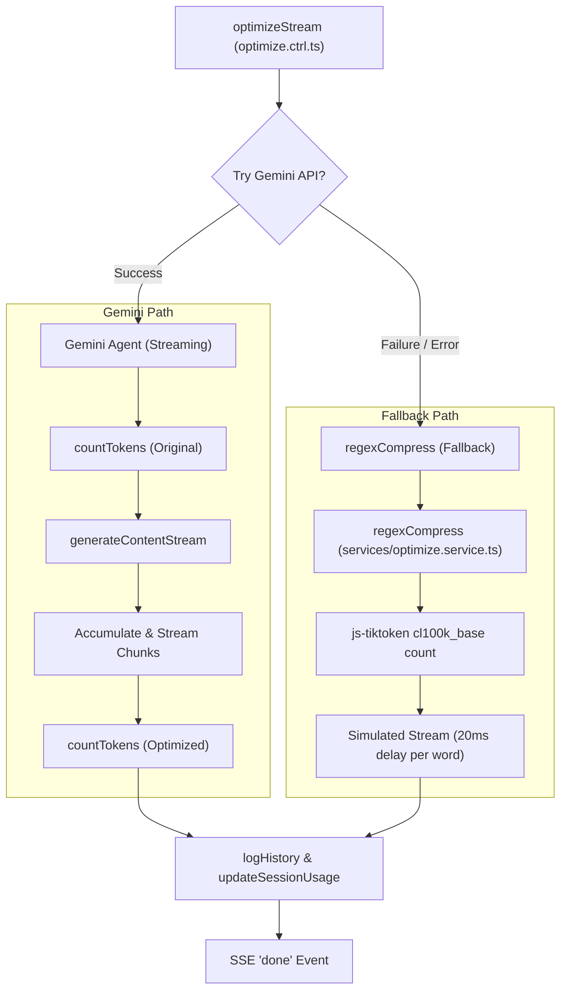
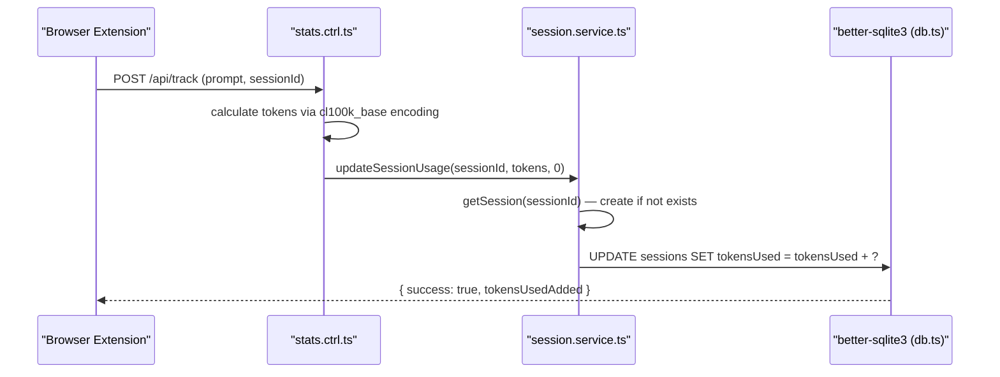
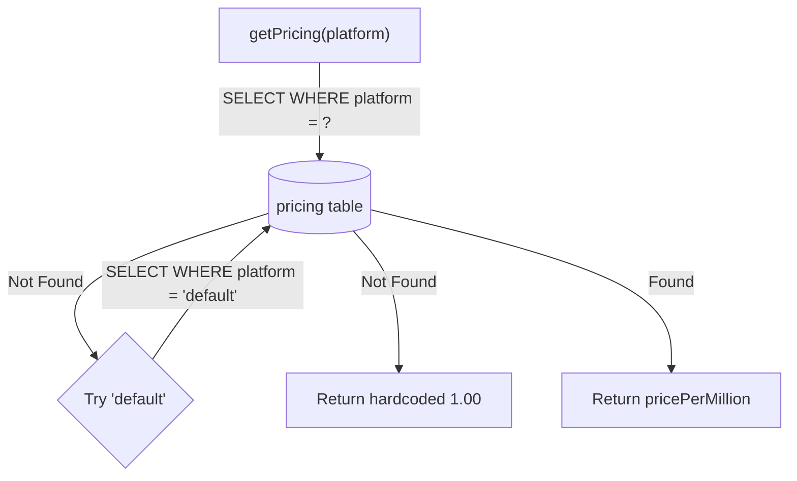
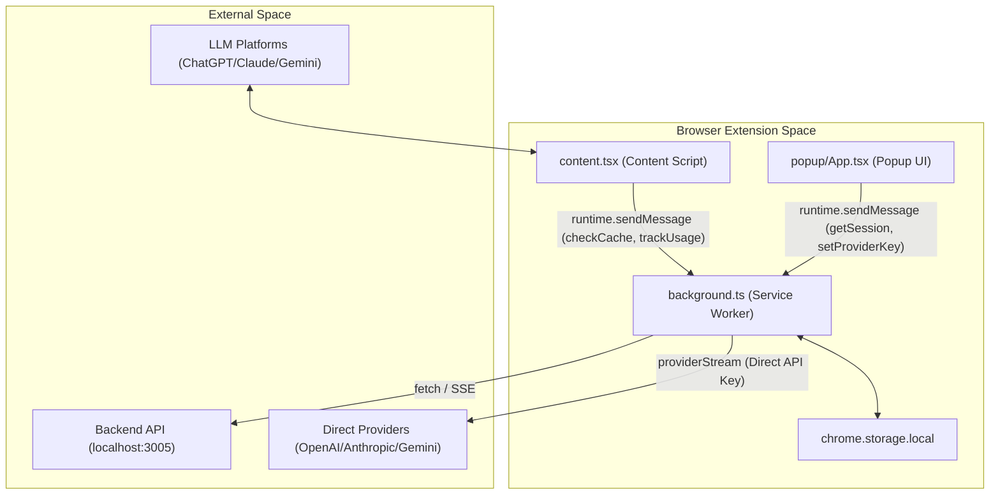
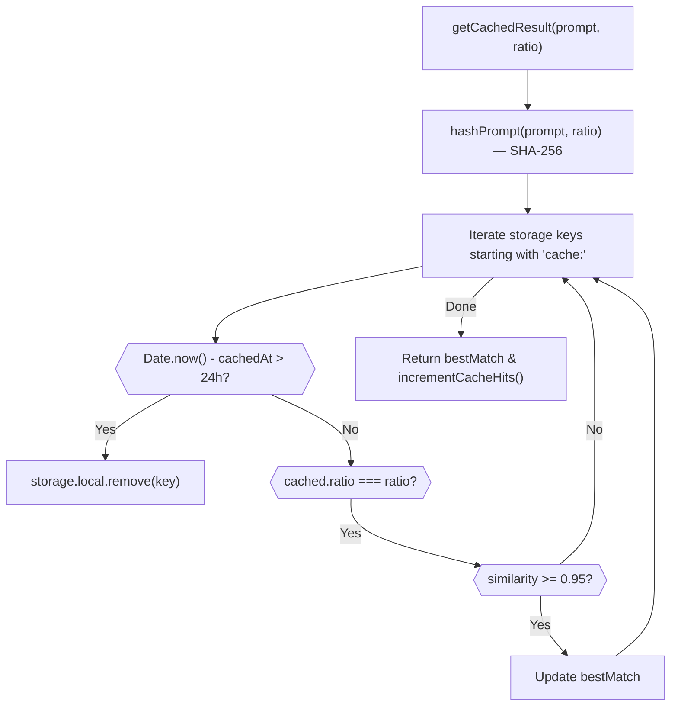
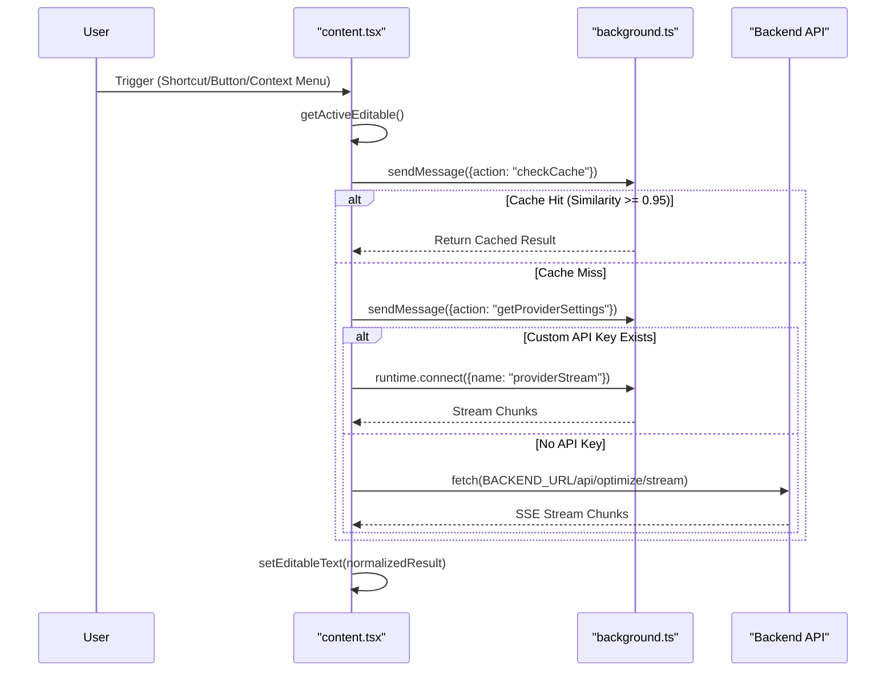
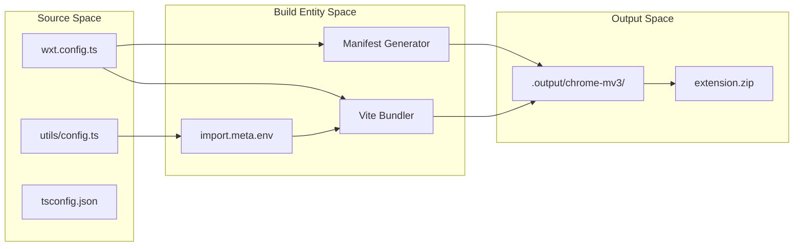

# Prompt Shaper

> LLM prompt optimization toolkit — compresses prompts to cut token costs while preserving intent.
> Ships as a **browser extension** backed by an **Express API**.

---

## Table of Contents

- [Overview](#overview)
- [Architecture](#architecture)
  - [System Interaction Diagram](#system-interaction-diagram)
  - [Monorepo Layout](#monorepo-layout)
  - [Operational Workflow](#operational-workflow)
- [Backend API (`apps/backend`)](#backend-api-appsbackend)
  - [Backend Architecture](#backend-architecture)
  - [API Routes Reference](#api-routes-reference)
  - [Prompt Optimization Engine](#prompt-optimization-engine)
  - [Session Management & Token Tracking](#session-management--token-tracking)
  - [Data Persistence Layer (SQLite)](#data-persistence-layer-sqlite)
  - [Pricing & Cost Calculation](#pricing--cost-calculation)
  - [Backend Key Dependencies](#backend-key-dependencies)
- [Browser Extension (`apps/extension`)](#browser-extension-appsextension)
  - [Extension Architecture](#extension-architecture)
  - [Background Service Worker](#background-service-worker)
  - [Content Script — In-Page Optimization UI](#content-script--in-page-optimization-ui)
  - [Popup UI — Dashboard & Settings](#popup-ui--dashboard--settings)
  - [Extension Permissions & Host Access](#extension-permissions--host-access)
  - [Extension Build System](#extension-build-system)
- [Infrastructure & Deployment](#infrastructure--deployment)
  - [Docker Containerization](#docker-containerization)
  - [Docker Compose Orchestration](#docker-compose-orchestration)
- [Getting Started](#getting-started)
  - [Prerequisites](#prerequisites)
  - [Installation](#installation)
  - [Environment Configuration](#environment-configuration)
  - [Running the Application](#running-the-application)
  - [Running with Docker](#running-with-docker)
- [Environment Variables Reference](#environment-variables-reference)
- [Database Schema](#database-schema)
- [Glossary](#glossary)

---

## Overview

Prompt Shaper solves the problem of high token consumption in long-form LLM interactions. By intercepting user input on popular AI platforms (ChatGPT, Claude, Gemini), the system applies compression techniques — ranging from simple regex patterns to sophisticated AI-driven summarization — to reduce the payload before it reaches the model provider.

**Key capabilities:**
- Real-time prompt compression via Google Gemini 2.5 Flash Lite (streaming SSE)
- Regex-based heuristic fallback when AI is unavailable
- Fuzzy prompt cache (Levenshtein similarity ≥ 95%) to avoid redundant API calls
- Support for user-provided API keys (OpenAI, Anthropic, Gemini) for private, direct compression
- Per-platform session tracking with token quotas and refresh windows
- Analytics dashboard with cost savings visualization (Recharts)
- Configurable pricing per platform (USD per million tokens)

---

## Architecture

### System Interaction Diagram



### Monorepo Layout

The project uses **npm workspaces** with the `apps/*` pattern to manage both applications from a single root.

```
prompt-shaper/
├── apps/
│   ├── backend/          # Express + TypeScript API (SQLite, Gemini, tiktoken)
│   │   ├── src/
│   │   │   ├── config/
│   │   │   │   └── db.ts               # SQLite init, schema, seeding
│   │   │   ├── controllers/
│   │   │   │   ├── optimize.ctrl.ts    # SSE optimization endpoint
│   │   │   │   └── stats.ctrl.ts       # Session, pricing, analytics
│   │   │   ├── routes/
│   │   │   │   └── api.routes.ts       # Express router
│   │   │   ├── services/
│   │   │   │   ├── optimize.service.ts # regexCompress fallback
│   │   │   │   └── session.service.ts  # getSession, logHistory
│   │   │   ├── utils/
│   │   │   │   └── pricing.util.ts     # getPricing, getPlatformConfig
│   │   │   └── index.ts                # Express entry point
│   │   ├── Dockerfile
│   │   ├── .dockerignore
│   │   ├── package.json
│   │   └── tsconfig.json
│   └── extension/        # WXT + React browser extension (Chrome / Firefox)
│       ├── entrypoints/
│       │   ├── background.ts           # Service worker, cache, provider stream
│       │   ├── content.tsx             # In-page Shadow Root UI
│       │   └── popup/
│       │       ├── App.tsx             # Dashboard + Settings React app
│       │       ├── main.tsx
│       │       └── index.html
│       ├── utils/
│       │   └── config.ts               # BACKEND_URL constant
│       ├── assets/
│       │   └── tailwind.css
│       ├── public/icon/                # 16/32/48/96/128px icons
│       ├── wxt.config.ts               # WXT manifest, permissions, Vite config
│       ├── package.json
│       └── tsconfig.json
├── docker-compose.yml
└── package.json                        # npm workspaces root
```

| Path | Workspace Name | Key Technologies |
|:---|:---|:---|
| `apps/backend` | `backend` | Express 5, TypeScript, SQLite (`better-sqlite3`), Gemini SDK, Tiktoken |
| `apps/extension` | `extension` | WXT, React 19, Vite, Tailwind CSS, Recharts |

### Operational Workflow



---

## Backend API (`apps/backend`)

The backend is a high-performance Express/TypeScript service that functions as the central engine for prompt compression, token evaluation, and usage analytics. It provides a streaming Server-Sent Events (SSE) interface for real-time prompt optimization.

### Backend Architecture



### API Routes Reference

All routes are mounted under the `/api` prefix.

| Method | Endpoint | Controller Function | Purpose |
|:---|:---|:---|:---|
| `POST` | `/optimize/stream` | `optimizeStream` | SSE endpoint for AI-powered prompt compression |
| `GET` | `/pricing` | `getPricingApi` | Returns all platforms and their price per million tokens |
| `POST` | `/pricing` | `updatePricingApi` | Updates price per million for a specific platform |
| `POST` | `/track` | `trackApi` | Increments `tokensUsed` for a session |
| `GET` | `/session/:sessionId` | `getSessionApi` | Returns session usage, limits, and time until refresh |
| `GET` | `/stats` | `getStatsApi` | Aggregates historical data for dashboard charts |
| `POST` | `/log-cache` | `logCacheApi` | Logs a hit from the extension's local fuzzy cache |
| `POST` | `/log-custom` | `logCustomApi` | Logs optimization events from custom provider keys |

#### SSE Event Shapes (`/optimize/stream`)

**Chunk event** (emitted during streaming):
```json
{ "type": "chunk", "text": "..." }
```

**Done event** (emitted on completion):
```json
{
  "type": "done",
  "originalTokens": 450,
  "optimizedTokens": 270,
  "tokensSaved": 180,
  "costSaved": 0.000900
}
```

#### Standard JSON Response Shape

```json
{ "success": true, "...data": "..." }
{ "success": false, "error": "message" }
```

### Prompt Optimization Engine

The engine follows a tiered execution strategy:



#### Primary Agent: Gemini 2.5 Flash Lite

The engine uses `gemini-2.5-flash-lite` governed by a strict **Context Curator** system instruction:

- **Preserve:** All instructions, facts, constraints, and intent
- **Eliminate:** Conversational filler, redundant examples, unnecessary politeness
- **Never modify:** Code blocks (` ``` `), JSON payloads, variable names inside quotes
- **Target:** Calculates `targetPercent` from user-provided `ratio` (default `0.6`)

#### Heuristic Fallback (`regexCompress`)

| Category | Targets |
|:---|:---|
| **Politeness** | `please`, `kindly`, `would you mind`, `I would appreciate it` |
| **Weak Modifiers** | `basically`, `actually`, `really`, `just`, `literally`, `simply` |
| **Transitions** | `as a matter of fact`, `in other words`, `needless to say` |
| **Whitespace** | Collapses 3+ newlines → 2; multiple spaces/tabs → 1 |

#### Dual Tokenization Strategy

| Path | Tokenizer | Implementation |
|:---|:---|:---|
| **Gemini Path** | `ai.models.countTokens` | Native Google Generative AI token counting API |
| **Fallback Path** | `js-tiktoken` | `cl100k_base` encoding (OpenAI-compatible) |

**Token savings formula:**
```
tokensSaved = Math.max(0, originalTokens - optimizedTokens)
```

### Session Management & Token Tracking

Sessions are lazily initialized and identified by a UUID suffixed with a platform identifier (e.g., `uuid-chatgpt`, `uuid-claude`, `uuid-gemini`).

#### Session Lifecycle



#### Platform Configurations

| Platform Suffix | Token Limit | Refresh Interval | Default Price (per 1M tokens) |
|:---|:---|:---|:---|
| `-chatgpt` | 40,000 | 3 hours | $5.00 |
| `-claude` | 200,000 | 5 hours | $3.00 |
| `-gemini` | 1,000,000 | 24 hours | $1.25 |
| *(default)* | 10,000 | 24 hours | $1.00 |

**Automatic refresh:** If elapsed time since `lastReset` exceeds the platform's `refreshMs`, `tokensUsed` resets to `0` and `lastReset` is updated.

### Data Persistence Layer (SQLite)

Managed by `better-sqlite3` (synchronous, no async/await needed). The database is auto-initialized on startup via `apps/backend/src/config/db.ts`.

#### Schema

**`sessions` table** — per-user/per-platform quota tracking

| Column | Type | Description |
|:---|:---|:---|
| `sessionId` | TEXT (PK) | Unique identifier (e.g., `UUID-platform`) |
| `tokensUsed` | INTEGER | Running total of tokens consumed in current window |
| `tokensSaved` | INTEGER | Cumulative tokens saved through optimization |
| `lastReset` | INTEGER | Unix timestamp of last quota window reset |

**`history` table** — audit trail of every optimization

| Column | Type | Description |
|:---|:---|:---|
| `id` | INTEGER (PK) | Auto-incrementing primary key |
| `sessionId` | TEXT | Reference to originating session |
| `prompt` | TEXT | Original raw input prompt |
| `compressed` | TEXT | Resulting optimized output |
| `originalTokens` | INTEGER | Token count before optimization |
| `optimizedTokens` | INTEGER | Token count after optimization |
| `costSaved` | REAL | Calculated USD saved based on pricing table |
| `timestamp` | INTEGER | Unix timestamp of the transaction |
| `method` | TEXT | Optimization method (`gemini-agent`, `fallback`, `cache`, `custom`) |

**`pricing` table** — configurable cost per million tokens

| Column | Type | Description |
|:---|:---|:---|
| `platform` | TEXT (PK) | Platform name (`chatgpt`, `claude`, `gemini`, `default`) |
| `pricePerMillion` | REAL | Cost in USD per 1,000,000 tokens |

**Index:** `idx_history_session_time` on `(sessionId, timestamp)` for fast dashboard queries.

### Pricing & Cost Calculation

**Cost saved formula:**
```
costSaved = (tokensSaved / 1,000,000) × pricePerMillion
```
Result is rounded to 6 decimal places before storage.

**Price lookup with double-fallback:**


### Backend Key Dependencies

| Package | Version | Purpose |
|:---|:---|:---|
| `express` | 5.x | Web framework for routing and middleware |
| `better-sqlite3` | latest | Synchronous, high-performance SQLite driver |
| `@google/genai` | latest | Official SDK for Gemini integration |
| `js-tiktoken` | latest | Token counting using `cl100k_base` encoding |
| `tsx` | latest | TypeScript execution for development watch mode |

---

## Browser Extension (`apps/extension`)

A WXT-powered React application that intercepts user prompts on ChatGPT, Claude, and Gemini, and optimizes them for token efficiency.

### Extension Architecture

The extension is divided into three primary functional areas communicating via `browser.runtime` messaging:

| Entrypoint | Type | Responsibility |
|:---|:---|:---|
| `background.ts` | Service Worker | Caching, API provider routing, context menus, persistent storage |
| `content.tsx` | Content Script | DOM injection, Shadow Root UI, optimization pipeline |
| `popup/App.tsx` | Popup | Dashboard visualization, settings, API key management |



### Background Service Worker

The background script (`background.ts`) is the central orchestration hub.

#### Context Menu
Registers an "Optimize with Prompt Shaper" right-click menu item. On click, sends a `trigger-optimize` message to the active tab.

#### Runtime Message Handlers

| Message Action | Function | Description |
|:---|:---|:---|
| `getSession` | `getSessionId()` | Retrieves or creates a UUID session from `chrome.storage.local` |
| `trackUsage` | `persistSessionData()` | Proxies usage to backend and mirrors locally for offline resilience |
| `getProviderSettings` | — | Fetches API keys and `preferredProvider` from local storage |
| `setProviderKey` | — | Persists a provider API key to local storage |
| `removeProviderKey` | — | Deletes a provider API key from local storage |

#### Fuzzy Prompt Cache



- **Algorithm:** Levenshtein distance
- **Similarity threshold:** ≥ 0.95
- **TTL:** 24 hours (86,400,000 ms)
- **Key hashing:** Normalizes whitespace + appends ratio → SHA-256 digest

#### Local Provider Streaming

Supports direct streaming from LLM providers using user-stored API keys via a long-lived `runtime.Port` named `providerStream`.

| Provider | Model |
|:---|:---|
| OpenAI | `gpt-4o-mini` |
| Anthropic | Claude Haiku |
| Gemini | Gemini 2.5 Flash Lite |

### Content Script — In-Page Optimization UI

The content script (`content.tsx`) runs in the host page context with an isolated Shadow Root React UI.

#### Three-Tier Optimization Pipeline

| Tier | Source | Trigger Condition |
|:---|:---|:---|
| **1. Cache** | `browser.storage.local` | Levenshtein similarity ≥ 0.95 |
| **2. Custom Provider** | Direct API (OpenAI/Claude/Gemini) | API key present in settings |
| **3. Backend SSE** | Prompt Shaper Backend | Default fallback |



#### DOM Probes (Active Editable Detection)

The `getActiveEditable` function uses a prioritized selector list:

1. **ChatGPT:** `#prompt-textarea`
2. **Claude:** `.ProseMirror`
3. **Gemini:** `rich-textarea > div[contenteditable="true"]`, `.ql-editor`, `div[role="textbox"]`
4. **Fallback:** `document.activeElement` (if `TEXTAREA`, `INPUT`, or `contenteditable`)

#### Submission Detection Loop

Polls every 500ms to detect when a user submits a prompt (Enter key or button click). If the input field is cleared within 2000ms of a submit action, it fires `trackUsage` to log session tokens.

#### Shadow Root UI Components

- **Tracker Side-Panel:** Compression ratio slider (default `0.6`), session token stats (`totalSaved`, `tokensRemaining`)
- **Toast Notification:** Shows tokens saved, percentage reduction, and method used after each optimization

### Popup UI — Dashboard & Settings

Built with React + Tailwind CSS. Communicates with both the Backend API and the Background Service Worker.

#### DashboardView

- Time-range selector: `7D`, `1M`, `3M`, `6M`, `1Y`
- `recharts` `LineChart` for token savings over time
- Aggregated stats: Total Tokens Saved, Estimated Cost Saved, Optimization Count

#### SettingsView

**Provider Configuration:**

| Provider | Model | Security Model |
|:---|:---|:---|
| **Gemini** | Gemini 2.5 Flash Lite | Server-managed OR local key |
| **OpenAI** | GPT-4o mini | Local key only (never sent to backend) |
| **Anthropic** | Claude Haiku | Local key only (never sent to backend) |

**Pricing Configuration:** Users can override the default price per million tokens per platform. Changes are sent via `POST /api/pricing`.

### Extension Permissions & Host Access

Defined in `wxt.config.ts`:

| Type | Value | Purpose |
|:---|:---|:---|
| Permission | `storage` | Cache, session data, API keys |
| Permission | `contextMenus` | Right-click "Optimize" menu |
| Host | `*://chatgpt.com/*` | Content script injection |
| Host | `*://claude.ai/*` | Content script injection |
| Host | `*://gemini.google.com/*` | Content script injection |
| Host | `http://localhost:3005/*` | Backend API communication |
| Host | `https://api.openai.com/*` | Direct OpenAI streaming |
| Host | `https://api.anthropic.com/*` | Direct Anthropic streaming |
| Host | `https://generativelanguage.googleapis.com/*` | Direct Gemini streaming |

### Extension Build System



| Command | Description |
|:---|:---|
| `npx wxt` | Dev server with HMR, auto-loads extension in browser |
| `npx wxt build` | Production build for Chrome (MV3) |
| `npx wxt build -b firefox` | Production build for Firefox |
| `npx wxt zip` | Creates distributable `.zip` for store submission |

---

## Infrastructure & Deployment

Prompt Shaper is designed for flexible deployment. The primary public instance uses a free-tier setup:

1. **Backend API:** Deployed as a web service on **Render**.
   - Public URL: `https://prompt-shaper.onrender.com`
   - Automatically built from the `main` branch.
2. **Browser Extension:** Packaged as a `.zip` file and distributed via GitHub.

### Free-Tier Deployment Strategy

If you wish to host your own instance for free:

- **Backend (Render):** Connect your GitHub repo to Render, set the Root Directory to `apps/backend`, Build Command to `npm install && npm run build`, and Start Command to `npm start`. Add your `GEMINI_API_KEY` to the environment variables.
- **Extension (GitHub Releases):** Run `npm run build` and `npm run zip` in the `apps/extension` folder, then upload the generated `.zip` to your GitHub Releases page to avoid Chrome Web Store fees.

*(Note: Render's free tier spins down after 15 minutes of inactivity and clears ephemeral storage, meaning SQLite history resets upon restart. For persistent free storage, consider Fly.io).*

---

## Getting Started

### Quick Install (Using Public Backend)

The easiest way to use Prompt Shaper is to install the pre-built extension which is already connected to our live Render backend.

1. Download the latest `extension-0.0.0-chrome.zip` from the root of this repository (or the Releases tab).
2. Extract the `.zip` file to a folder on your computer.
3. Open Google Chrome and navigate to `chrome://extensions`.
4. Enable **Developer mode** using the toggle in the top right corner.
5. Click **Load unpacked** and select the folder you just extracted.
6. Open ChatGPT, Claude, or Gemini and start typing!

### Local Development (Self-Hosted)

If you want to run the backend yourself or modify the code:

#### Prerequisites
- **Node.js** v20+ and **npm**
- **Google Gemini API Key**

#### 1. Setup Backend
```bash
git clone https://github.com/harshitzofficial/Prompt-shaper.git
cd Prompt-shaper

# Install dependencies
npm install

# Add your Gemini Key
echo "GEMINI_API_KEY=your_google_api_key_here" > apps/backend/.env

# Start the backend API on port 3005
npm run dev -w backend
```

#### 2. Setup Extension
```bash
# In a new terminal window
echo "WXT_BACKEND_URL=http://localhost:3005" > apps/extension/.env

# Run the extension dev server
npm run dev -w extension
```

### Self-Hosting with Docker

You can easily deploy the backend to your own VPS (DigitalOcean, AWS, etc.) using Docker Compose. This ensures your SQLite database history is persisted in a Docker volume.

```bash
# Add your Gemini API key to apps/backend/.env, then run:
docker compose up -d --build
```


## Environment Variables Reference

### Backend (`apps/backend`)

| Variable | Default | Required | Description |
|:---|:---|:---|:---|
| `GEMINI_API_KEY` | — | **Yes** | Google Generative AI key for prompt compression |
| `PORT` | `3005` | No | Port the Express server listens on |
| `DB_PATH` | `database.sqlite` | No | Path to the SQLite database file |

### Extension (`apps/extension`)

| Variable | Default | Required | Description |
|:---|:---|:---|:---|
| `WXT_BACKEND_URL` | `http://localhost:3005` | No | Base URL of the Prompt Shaper backend API |

> **Note:** Extension environment variables must be prefixed with `WXT_` to be accessible via `import.meta.env` at build time.

---

## Database Schema

```sql
-- Session quota tracking
CREATE TABLE IF NOT EXISTS sessions (
    sessionId   TEXT PRIMARY KEY,
    tokensUsed  INTEGER DEFAULT 0,
    tokensSaved INTEGER DEFAULT 0,
    lastReset   INTEGER DEFAULT (strftime('%s','now') * 1000)
);

-- Optimization audit trail
CREATE TABLE IF NOT EXISTS history (
    id               INTEGER PRIMARY KEY AUTOINCREMENT,
    sessionId        TEXT,
    prompt           TEXT,
    compressed       TEXT,
    originalTokens   INTEGER,
    optimizedTokens  INTEGER,
    costSaved        REAL,
    timestamp        INTEGER,
    method           TEXT
);

-- Configurable pricing per platform
CREATE TABLE IF NOT EXISTS pricing (
    platform        TEXT PRIMARY KEY,
    pricePerMillion REAL DEFAULT 1.0
);

-- Default seed values
INSERT OR IGNORE INTO pricing VALUES ('chatgpt', 5.00);
INSERT OR IGNORE INTO pricing VALUES ('claude',  3.00);
INSERT OR IGNORE INTO pricing VALUES ('gemini',  1.25);
INSERT OR IGNORE INTO pricing VALUES ('default', 1.00);

-- Performance index for dashboard queries
CREATE INDEX IF NOT EXISTS idx_history_session_time
    ON history (sessionId, timestamp);
```

---

## Glossary

| Term | Definition |
|:---|:---|
| **Prompt Compression** | Reducing the token count of an LLM prompt while maintaining its original intent, facts, and constraints |
| **Context Curator** | The system instruction persona given to the compression LLM defining what to remove and what to preserve |
| **Session** | A tracking entity (UUID + platform suffix) managing rate limits and token quotas over a refresh window |
| **SSE** | Server-Sent Events — used to stream compressed text from the backend to the extension in real time |
| **Ratio** | A float (default `0.6`) representing the target size of the optimized prompt relative to the original |
| **PricePerMillion** | Cost in USD for 1,000,000 tokens, used to calculate `costSaved` |
| **cl100k_base** | The tokenization encoding used by `js-tiktoken` for local token counting (OpenAI-compatible) |
| **WXT** | Web Extension Toolbox — the framework used to build the cross-browser extension |
| **Shadow Root UI** | The extension injects its interface via Shadow DOM to prevent CSS leaking from/to the host page |
| **Provider Stream** | Direct client-side optimization using user-stored API keys, bypassing the Prompt Shaper backend |
| **Fuzzy Prompt Cache** | A local cache using Levenshtein distance to find near-matches (≥ 95% similarity) for prompts |
| **regexCompress** | Heuristic fallback compression using regex patterns to strip filler words when Gemini is unavailable |

[](https://deepwiki.com/harshitzofficial/Prompt-shaper)
